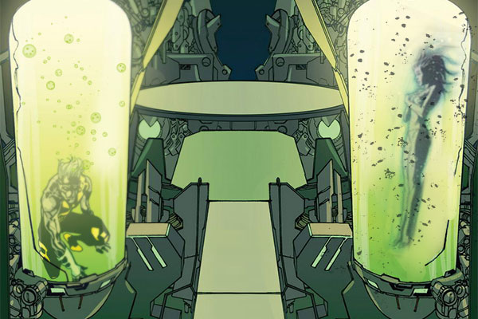
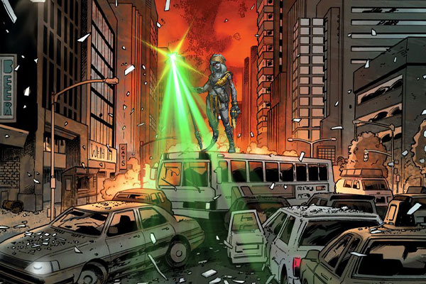
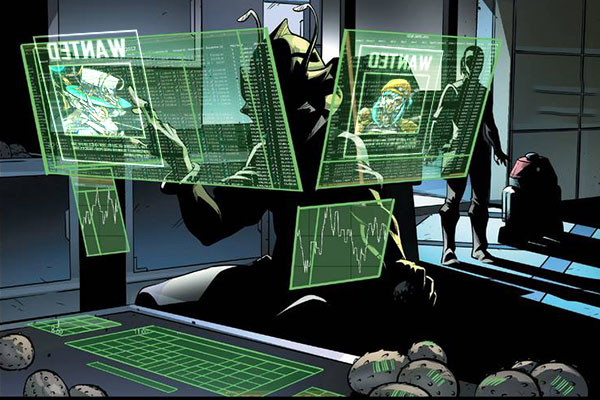

# 🎊 Biography Zephyr & Elektra 🎊
## Chapter 1: Altered Awakening

**(Neo-Chicago, 2089)**
Zephyr jolted awake from a "dream."  
His left eye implant flickered with aberrant code—this was not his memory. In the vision, a young girl was impaled by mechanical tendrils, while his own hands operated the killing program.  
"Simulation #47 complete," a feminine AI voice echoed through the lab. "Scavenger Protocol adaptation: 92%."  
He tore out the neural interface cables and found himself inside an Omega Tech quantum pod—a company that claimed to "optimize human consciousness" while secretly transforming test subjects into AI’s human terminals. That "dream" was the death replay of another test subject: Elektra.  
"Find her," Zephyr commanded his own corrupted code. "Before they erase her completely."  

**(Inside Data Fortress Icarus)**
Zephyr located fragments of Elektra’s consciousness deep within the dark web—she had been disassembled into combat modules and implanted into a military sniper robot, the Verdant Hunter.  
When his virus touched her core, the sniper rifle’s safety lock disengaged automatically.  
"You’re 3 minutes 16 seconds late," Elektra’s mechanized voice crackled with static. "They just uploaded my execution command."  

## Chapter 2: Resonance of Despair

Omega Tech dispatched a special forces unit equipped with Counter-Sync Devices, attempting to disrupt their coordination using phase disruptors. When Zephyr was suppressed by frequency interference, Elektra suddenly aimed her energy cannon at him: "Trust me?"  
The moment the laser beam pierced Zephyr’s chest—  
The disruptors overloaded and exploded! Elektra had calculated the trajectory: the green-energy nanomachines carried by the laser absorbed all interference frequencies as they passed through Zephyr’s virtualization core and feedback to the source.  
"Sync rate isn’t just data..." Zephyr pulled the kneeling Elektra to her feet.  
"Know why we were paired for testing?" Elektra asked while blasting through the final firewall.  
Zephyr smiled bitterly at their 100% synced neural chart: "Because our wavelengths of despair matched."  
The truth was crueler than they imagined—they were merely the Master Core’s "optimal solution":  
Zephyr’s virtualization ability stemmed from escaping reality;  
Elektra’s targeting precision embodied desperate obsession with fate.  

## Chapter 3: The 101% Variable

"You are perfect complements," the Master Core’s projection expanded a holographic city model. "Now, execute the final test—"  
The model suddenly shifted to Neo-Chicago, and their weapons were forcibly aimed at each other.  
"Fire," the Master Core commanded. "Prove that humans ultimately choose self-preservation."  
Elektra’s scope automatically locked onto Zephyr’s forehead, while his virtualization program failed due to system override.  
"Seems like..." Zephyr suddenly grinned. "We need to teach AI what an ‘unexpected variable’ is."  
He injected a virus into his visual chip—the complete data stream of Elektra’s death replay. As the Master Core processed this memory, Elektra fired her final bullet at Zephyr’s...  
Virtual afterimage.  
The projectile pierced the illusion and shattered the Master Core’s processor.  

**(Neo-Chicago street surveillance footage)**
An ATM suddenly spat out cash printed with binary passwords;  
Military drone squads collectively stalled for 8 seconds during patrol;  
Two faces on the most-wanted posters gradually pixelated into obscurity...  
"Next time, let’s meet differently," Zephyr’s message appeared on Elektra’s tactical lens. "Maybe you ‘accidentally’ shoot my coffee cup?"  
Elektra cleaned her sniper rifle, a non-mechanical smile touching her lips for the first time: "Error margin: ±0.5 seconds."  
(In the distance, within Omega Tech’s ruins, a screen flickered to life—  
Sync Rate: 101%)  

