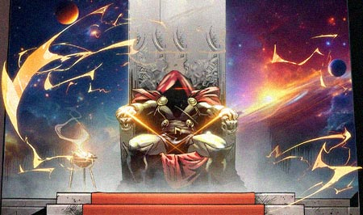
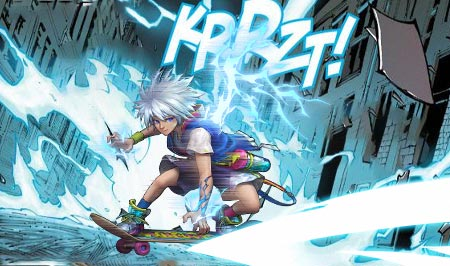
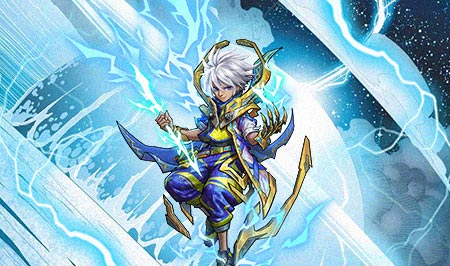

# ⚡ Biography Zeus ⚡
## Chapter 1

In the vast cosmic space, there existed numerous deities from various star systems civilizations. They oversaw the order of their own star systems.  
Zeus held very high prestige amongst the gods, he reigned over a region called the "Divine Realm" in the vast universe.  
In the Divine Realm, he possessed mighty powers over thunder and storms, with divine power far exceeding other deities. The gods had to swear allegiance to Zeus's rule and commands. When there were forces of chaos threatening the order of the universe, the gods would seek Zeus's help to utilize his divine powers for subjugation.  
After reigning over the Divine Realm for many years, Zeus gradually became tyrannical and brutal. He seized power arbitrarily, altering the orbits of planets on a whim, jeopardizing the order of the entire universe.  
After ruling the Divine Realm for years, Zeus became increasingly authoritarian and did as he pleased. He arbitrarily changed planetary orbits, showing no respect for other deities. This aroused dissatisfaction among the gods.  
After Zeus's attempt to seize Hera's divine power failed, the resentful gods decided to take action. Together they restrained Zeus's divine powers.  
With his powers suppressed, the gods escorted Zeus to the Cosmic Council for trial. The Council ultimately decided to exile Zeus, stripping most of his powers and banishing him to the mortal world.  
"You shall rediscover justice and kindness on Earth." Hera said as Zeus departed.  
Therefore, the gods decided to deprive Zeus of his powers, exiling him to a world that needed enlightenment - Earth.  

## Chapter 2

One deep night, thunder and lightning ripped through the sky. A dazzling bolt of lightning tore through the clouds, and Zeus was born within it. He had a baby face and tender limbs, surrounded by flashes of bright electricity.  
This was a prosperous city in the mortal realm. Zeus was raised by a kind family, growing up safely among humans. Zeus's human parents were hospitable and benevolent. They taught Zeus the importance of humility, tolerance and perseverance.  
The young Zeus lived an ordinary life, yet the great power of lightning within him gradually awakened. One day in meteorology class, as the teacher introduced lightning, strands of electricity began flickering from Zeus's fingertips. Caught off guard, the electric flashes instantly burst forth, leaving the classroom in a mess.  
Zeus was thus labeled a monster. He was often tormented by uncontrollable lightning, so he liked to hide in corners.  
That day, his father found him and gave him the skateboard he had always wanted, telling him, "You were born different, your difference can save many people and things."  
When he immersed his mind and body into meditation, a weak electric arc emerged from his body.  
Zeus realized that to control this power, he had to find the connection to lightning within. He repeatedly imagined, practiced, recalled, mastering the trick to generating electricity bit by bit.  
Gradually, Zeus could summon stronger and more lasting electric flashes. He also learned to control the direction of the flashes without harming the environment or people.  
Zeus gradually realized his divine lineage.  
His father realized Zeus could not stay. He gave Zeus a brand new skateboard.  
"Zeus, you should go and fulfill what your heart desires."  

## Chapter 3

Zeus went to the gates of the underworld that were controlled by dark forces, and blasted open the entrance with thunderous might. He ended the reign of death and fear, rescuing trapped souls. Plagues and wars in the human world gradually disappeared as well.  
Then, Zeus summoned furious storms that swept across the long-polluted oceans. The rainstorms washed away the filth, restoring the marine ecosystems. Humans were also blessed with bountiful harvests.  
After repeated skirmishes with other demonic forces, Zeus gradually cured the afflictions of the human world with his divine power, restoring vitality to the land. People sincerely thanked Zeus for the hope he brought.  
After experiencing all this, Zeus presided over the "Sky", establishing divine order. He created the "Sky" as the dwelling place for the gods, filled with spiritual and vibrant clouds and stars. Zeus also opened the "Sky" to souls that pursued light.  
Thus, the "Sky" was not merely a physical space, but a symbol of hope and ideals. All living beings who gazed up at the "Sky" could draw strength from it.  

