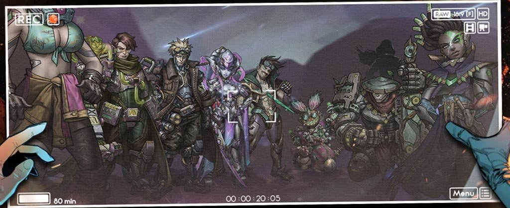

# 💫 Multi-Universe Space 💫

📍**IFOB Command Center**
Looking at the people in the Command Center, Gilbert said, “the situation of Dream Realm 01 Universe is most urgent, after much discussion we decided to start the war at Multi-Universes, we will invite all approved Guilds to join this operation, after all, this concerns the safety of the entire universe. There are currently two problems, which we need to solve: The first is we need a new kind of aircraft that can shuttle through The Vortex.” He paused for a moment and glanced at Sobel.  
Sobel was looking into the eyes of the audience, tapped his cigarette and said, “I’ll think of something, I never considered going back before coming here. I think I’ll need an improved energy source and more durable material.”  
“Dark Plants probably, we Dragons have discovered Universe Particle Blade can cut through the Imaginary Nodes in the Dark Plants, the energy waves emitted from cutting nodes can be collected and used, as long as all nodes are not cut, they will fully recover in the Dark Plant after a certain amount of time. It’s a really good source of renewable energy. The only fall back is that someone with experience has to be sent to constantly cut off the tentacles of Dark Plants, otherwise they would gradually erode the whole ship.” Rhaegal swiftly joined the conversation.  
“Consider this task appointed to you then Mr. Sobel, if you need anything you can find Shreatah, he will provide you with the resources you need. As for the second problem, which is also the more urgent one, is how to weaken the son of Yidhra. According to the current intel from Ms. Irene, the son of Yidhra is becoming more and more active, it seems like the entire Monoceros has been effected, we need to find a way to weaken his powers to restrain his awakenings. Mr. Megalith, you know what his powers are capable of better than anyone, do you have any suggestions?“  
“Dreams are his power branch, but the Galaxy of 01 Universe has become his source of nourishment because of the connection with the Oasis. We thought about destroying the Oasis, but it has already become a part of his Dream Realm, the Oasis does not embody any physical form right now and we cannot destroy it.   
However, when I was training underground I had experienced this power for a long long time, I believe my powers and his powers in essence are the same. I can also feel my body's desire for that power even in this side of The Vortex. In other words, we can try to compete with him for his power, should there be a way to strip it away from him then we should be able to weaken him.“  
“That’s pretty dangerous. Since this power can be transmitted in such a complex environment of The Vortex, when we purify and strip it, our universe is also in danger of being infected by it....”, Dr. Sumio exclaimed with concern.  
“Infection of this power? I don’t think it will be more dangerous than Lavinia’s powers. Apologies, Mr. Megalith, I don’t mean any offense, but what I felt from Lavinia’s power makes me tremble on a more grandeur scale, your Dream powers does not produce this type of intimidation. We have managed to control Lavinia’s Powers, then the Dream Powers should not even be worth mentioning. Sir, we need the bravery you had when you were in the Multi Universe experiment, in order to face those mysterious beings. Give me some rough samples of Dream power, if it goes smoothly, then I feel that we may be able to use this power after all, like how I used Lavinia’s power before.” $age all of sudden stood in excitement, he looked over at Mikaela who was in a daze.  
“Mika, I can provide the technology I used to track down Lavinia’s power and you can try to use the technology of extracting the Universe Particles to strip Dream powers. What do you think?“
Mikaela was a little unhappy about being interrupted for deserting, scratched her head and said, “Alright, alright, but I’ll need a lot of Universe Particles, as I guess only the container made of Universe Particles can hold that power.“  
“Great, then I wish you all the best of luck, Ladies and Gentlemen, that’s all for this conference, I can smell the victory now.”  

---
Three months later, $age was walking out of the newly established Multi-Universe Essence Institute while rapping a song and saw Shreatah going in and called to him, “Hey man, best not to disturb Mika, she’s now in a crucial stage.” While waving his hand, he bumped the unknown object similar to the magic cube in his hand and walked to the Command Center.  

